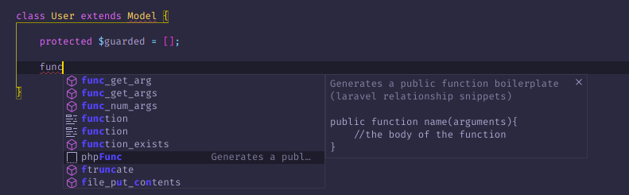
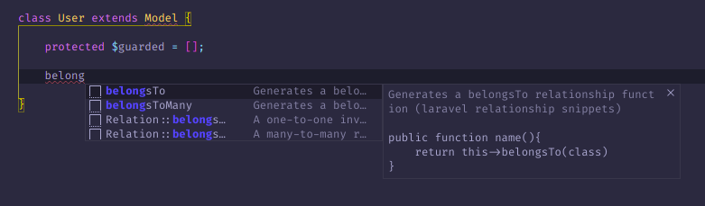

# laravel-relationship-snippets README

## Features

This snippet extension allows you to quickly scaffold your relationship code in your laravel application models as well as generating regular functions code. 

---

## Requirements

This extension works only with php files.

## Release Notes

### 1.0.0

Initial release of laravel relationship snippets
